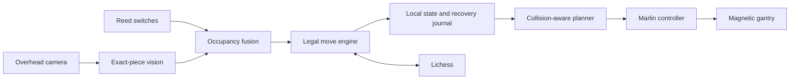

<p align="center">
  
</p>

<h1 align="center">Chess Gantry</h1>

<p align="center">
  <strong>A chessboard that sees the position, understands the move, and moves the pieces.</strong>
</p>

<p align="center">
  Exact-piece overhead vision · Reed sensing · Collision-aware motion · Lichess · Marlin · Raspberry Pi
</p>

<p align="center">
  
  
  
  
  
</p>

<p align="center">
  <a href="#five-minute-demo">Five-minute demo</a> ·
  <a href="#vision">Vision</a> ·
  <a href="#reed-switches">Reed switches</a> ·
  <a href="#raspberry-pi">Raspberry Pi</a> ·
  <a href="#commissioning">Commissioning</a> ·
  <a href="#operation">Operation</a>
</p>

---

Chess Gantry converts legal chess moves into guarded Marlin G-code for a
magnetic Cartesian gantry. It can observe a physical board, identify every
tagged piece and square, infer a legal move, mirror or update a Lichess game, and
move the corresponding piece.



| Layer     | Current implementation                                               |
| --------- | -------------------------------------------------------------------- |
| Vision    | One overhead camera, 32 unique piece tags, 4 board-reference tags    |
| Occupancy | Synthetic 8 x 8 matrix plus MCP23017 reed diagnostics                |
| Rules     | `python-chess` legal move matching and FEN tracking                  |
| Motion    | Collision-aware routes, bounded coordinates, Marlin acknowledgements |
| State     | Atomic local JSON and append-only audit log                          |
| Web       | Clerk-authenticated operator dashboard                               |
| Runtime   | Fedora 42 builder, final `FROM scratch`, UID/GID 65532               |

> [!WARNING]
> This project moves real hardware and energizes an electromagnet. Keep an
> independent physical cutoff within reach. Do not run physical commands until
> endstops, direction, workspace, magnet electronics, and the complete path are
> verified. Software safety checks do not replace safe mechanical and electrical
> design.

## Five-Minute Demo

No controller, camera, Pi, reed switches, or motors are required.

### Install

Requirements: Python 3.9+, [`uv`](https://docs.astral.sh/uv/), Node.js, npm, and
Git.

```bash
uv sync
npm ci
```

### Verify Everything

```bash
./scripts/demo_check.sh
```

This runs the complete test and policy suite, plans `e2e4`, simulates motion and
the magnet, renders a perspective-distorted tagged board, and detects the exact
piece transition. It opens no serial, I2C, or camera device.

Expected final line:

```text
Demo readiness checks passed, including exact-piece vision. No physical serial port was opened.
```

### Inspect Exact-Piece Vision

Standard position:

```bash
uv run chess-gantry vision-test \
  --source demo --frames 3 --stable-frames 3 --interval 0.1
```

Simulated `e2e4`:

```bash
uv run chess-gantry vision-test \
  --source demo:e2e4 --frames 3 --stable-frames 3 --interval 0.1
```

The accepted transition includes the permanent physical identity and both
coordinate systems:

```json
{
  "uci": "e2e4",
  "piece_id": "white_pawn_e",
  "from": { "square": "e2", "coordinate": { "x": 4, "y": 1 } },
  "to": { "square": "e4", "coordinate": { "x": 4, "y": 3 } }
}
```

### Start The Demo Dashboard

Use a Clerk development publishable key for plain HTTP:

```bash
export CLERK_PUBLISHABLE_KEY="pk_test_your_key"
./scripts/live_demo.sh
```

Open <http://127.0.0.1:8000>. In **Overhead exact-piece vision**, use `demo` or
`demo:e2e4`. In **Synthetic 8 x 8 sensor lab**, run the built-in move datasets.

## Vision

### Why Fiducials, Not Color Or A Generic CNN?

Raw colors change with exposure, white balance, shadows, glare, printing, and
JPEG compression. A generic chess CNN usually predicts a class such as “white
rook”; it cannot distinguish the two physical white rooks and may fail when the
board, pieces, lens, or lighting differs from its training set.

Chess Gantry uses unique error-correcting ArUco MIP tags because they provide:

- exact physical identity, not only color or class;
- no model training or GPU requirement;
- fast ARM64 inference with headless OpenCV;
- perspective registration from four fixed references;
- explicit rejection instead of an untrustworthy low-confidence guess.

A future CNN can add secondary checks for hands, fallen pieces, or missing caps.
It should not replace the authoritative identity channel without a board-specific
dataset and independent accuracy validation.

### What The Detector Guarantees

Every status response examines all configured pieces and reports:

| Field             | Example                                                    |
| ----------------- | ---------------------------------------------------------- |
| Physical identity | `white_pawn_e`                                             |
| Marker            | `22`                                                       |
| Type and color    | `white pawn`                                               |
| Expected square   | `e2`                                                       |
| Observed square   | `e4`                                                       |
| Board coordinate  | `{x: 4, y: 3}` where `a1 = {0,0}`                          |
| Camera cell       | `{row: 4, column: 4}` where image top-left is `a8`         |
| State             | `matched`, `moved`, `missing`, `unexpected`, or `captured` |

The detector accepts a move only when the same complete position appears for
three frames and matches exactly one legal successor. It rejects missing
references, invalid board geometry, unknown or duplicate IDs, small tags,
off-board tags, two tags on one square, square-boundary placements, illegal
positions, and occupancy disagreement.

Hands and sleeves cause a waiting state. That is intentional: safe abstention is
better than silently recording the wrong move.

Supported transitions include normal moves, captures, en passant, castling, and
promotion. A tag remains the same physical identity after promotion while its
tracked type changes. Position alone cannot distinguish four promotion choices,
so ambiguous promotion defaults to queen and records that policy.

### Generate The Marker Set

```bash
uv run chess-gantry vision-markers \
  --output-dir data/vision-markers \
  --marker-pixels 600
```

Output:

| IDs          | Use                          |
| ------------ | ---------------------------- |
| `0`          | Board top-left reference     |
| `1`          | Board top-right reference    |
| `2`          | Board bottom-right reference |
| `3`          | Board bottom-left reference  |
| `10` to `41` | The 32 exact starting pieces |

`data/vision-markers/manifest.json` maps each piece ID to its marker. Print
without interpolation, preserve the white border, and mount each piece marker
horizontally on a flat, centered, matte cap. Do not bend tags over piece tops.

### Camera Layout

```text
reference 0                                      reference 1
                         camera
                           |
                           v
                    a8 . . . . h8
                    .           .
                    .   board   .
                    .           .
                    a1 . . . . h1
reference 3                                      reference 2
```

Use one rigid camera directly above the board:

- normal lens, not ultra-wide;
- board fills roughly 70 to 85 percent of the image;
- all four references remain visible;
- 1440p or higher is preferred for small caps;
- piece tags should appear at least 40 to 60 pixels wide;
- diffuse symmetrical lighting and matte surfaces;
- lock orientation, focus, exposure, white balance, and zoom when possible.

The homography corrects moderate perspective. It cannot remove severe parallax
from an angled camera or a tall off-center cap.

### Test A Photo

```bash
uv run chess-gantry vision-test \
  --source /path/to/board.jpg \
  --frames 3 --stable-frames 3
```

A standard board should report `state: ready`, 32 observed pieces, no error, and
a smallest marker comfortably above the 24-pixel rejection floor.

### Use A Phone

Run a LAN camera app on a phone mounted above the board. Use its actual MJPEG,
RTSP, or JPEG endpoint, not the HTML landing page.

MJPEG example:

```bash
uv run chess-gantry vision-test \
  --source 'http://PHONE_IP:8080/video' \
  --frames 30 --stable-frames 3 --interval 0.2
```

Snapshot endpoints are often sharper and less buffered:

```bash
uv run chess-gantry vision-test \
  --source 'snapshot:http://PHONE_IP:8080/shot.jpg' \
  --frames 10 --stable-frames 3 --interval 0.3
```

Keep the phone powered, disable sleep, and place it on the same non-isolated LAN
as the Pi. In a container, `localhost` means the container, not the phone.

### Use A USB Camera

```bash
ls -l /dev/video* 2> /dev/null
uv run chess-gantry vision-test \
  --source /dev/video0 --frames 30 --stable-frames 3
```

Raspberry Pi CSI cameras that expose only a libcamera pipeline must first be made
available as a working V4L2 or network stream.

### Acceptance Before Automatic Writes

Before enabling Lichess or second-board writes, replay 500 to 1,000 real moves
under varied lighting and include captures, castling, en passant, occlusion,
hidden tags, boundary placements, camera movement, and network failure. Measure
wrong commits separately from abstentions. The release criterion for automatic
writes should be zero wrong commits.

## Reed Switches

Vision works independently while reed hardware is diagnosed. Keep the reed path:
it provides lighting-free occupancy and becomes an independent veto when a full
8 x 8 matrix is available.

### Known Single-Pin Test

Default wiring for an active-low normally open switch:

```text
Pi GPIO 2 / SDA  -> MCP23017 SDA
Pi GPIO 3 / SCL  -> MCP23017 SCL
Pi 3V3           -> MCP23017 VDD and RESET
Pi GND           -> MCP23017 VSS and A0/A1/A2
MCP23017 GPB0    -> reed switch -> GND
```

```text
No magnet       OPEN / HIGH
Magnet present  CLOSED / LOW
```

Enable I2C and verify address `0x20`:

```bash
sudo raspi-config nonint do_i2c 0
sudo reboot
sudo apt install -y i2c-tools
i2cdetect -y 1
```

Run a ten-second GPB0 test:

```bash
uv run chess-gantry reed-test \
  --bus 1 --address 0x20 --samples 100 --interval 0.1
```

### Diagnose Multiple Expanders

Discover `0x20` through `0x27` without writing configuration registers:

```bash
uv run chess-gantry reed-bank-test \
  --bus 1 --first-address 0x20 --last-address 0x27 --samples 1
```

After `i2cdetect` confirms a specific address is a reed-only MCP23017, configure
and watch all 16 pins on that device:

```bash
uv run chess-gantry reed-bank-test \
  --bus 1 --first-address 0x20 --last-address 0x20 \
  --configure-inputs --samples 100 --interval 0.1
```

> [!CAUTION]
> `--configure-inputs` writes all GPA/GPB pins as pulled-up inputs. Never use it
> on an unknown device or an MCP23017 that intentionally drives outputs.

The report isolates address, bus, power, pull-up, pin, and switch failures. It
does not invent a chess-square map. A full board map requires the real expander
addresses, pin-to-square order, active levels, and wiring topology.

### Fusion

The conservative fusion rule is:

```text
vision occupancy == auxiliary 8 x 8 occupancy
and exact identities match exactly one legal successor
```

Disagreement produces `conflict`; neither source silently overrides the other.
The dashboard currently uses the synthetic 8 x 8 matrix to exercise this logic
until a verified physical 64-square mapping is supplied.

## Raspberry Pi

### Requirements

- Raspberry Pi with 64-bit ARM OS; 32-bit `armv7l` is rejected
- Docker Engine
- Clerk development publishable key for plain-HTTP dashboard access
- Optional `/dev/ttyUSB0`, `/dev/i2c-1`, and `/dev/video*`

### Install

```bash
sudo apt update
sudo apt install -y git curl
git clone --recurse-submodules https://github.com/odinglyn0/Chess.git
cd Chess
export CLERK_PUBLISHABLE_KEY="pk_test_your_key"
./scripts/install_pi.sh
```

If the installer enables I2C, reboot and rerun it.

### Run

No camera:

```bash
export CLERK_PUBLISHABLE_KEY="pk_test_your_key"
./run.sh
```

Phone camera:

```bash
export CLERK_PUBLISHABLE_KEY="pk_test_your_key"
CHESS_GANTRY_CAMERA_SOURCE='snapshot:http://PHONE_IP:8080/shot.jpg' ./run.sh
```

USB/V4L2 camera:

```bash
export CLERK_PUBLISHABLE_KEY="pk_test_your_key"
CHESS_GANTRY_VIDEO_DEVICE=/dev/video0 ./run.sh
```

Open the printed URL, normally `http://chess.local` or the Pi's LAN address.
Control-C stops and removes the foreground container.

`run.sh` builds the image, creates missing local state, mounts `config.json` and
`data/`, attaches available serial/I2C/camera devices with their host groups,
and starts simulated Marlin when no serial controller exists.

Useful overrides:

| Variable                     | Default        | Purpose                                  |
| ---------------------------- | -------------- | ---------------------------------------- |
| `CHESS_GANTRY_SERIAL_PORT`   | `/dev/ttyUSB0` | Marlin device                            |
| `CHESS_GANTRY_I2C_DEVICE`    | `/dev/i2c-1`   | MCP23017 bus device                      |
| `CHESS_GANTRY_CAMERA_SOURCE` | empty          | Network, RTSP, or `snapshot:` source     |
| `CHESS_GANTRY_VIDEO_DEVICE`  | empty          | Host V4L2 device passed as `/dev/video0` |
| `CHESS_GANTRY_HTTP_PORT`     | `80`           | Primary dashboard port                   |
| `CHESS_GANTRY_MDNS_NAME`     | `chess.local`  | Advertised LAN name                      |

Set only one camera variable.

### Distroless Runtime

The production image is built with Fedora 42 and finishes with `FROM scratch`.
It contains Python, the application, OpenCV, runtime libraries, CA certificates,
timezone data, and `curl` for health checks. It contains no shell, package
manager, Node.js, compiler, or Git client and runs as UID/GID 65532.

Inspect it from the host:

```bash
docker ps --filter name=chess-gantry
docker logs -f chess-gantry
docker inspect --format '{{.State.Health.Status}}' chess-gantry
```

### Update

```bash
git pull --ff-only
git submodule update --init --recursive
export CLERK_PUBLISHABLE_KEY="pk_test_your_key"
./run.sh
```

`config.json` and `data/` are preserved.

## Commissioning

Follow this order the first time hardware is connected. Do not skip to a chess
move.

### Machine Reference

| Property                   | Value          |
| -------------------------- | -------------- |
| Inner gantry width         | 330 mm         |
| Outer paired gantry height | 300 mm         |
| Square spacing             | 40 mm          |
| Nearest-home square        | h1             |
| Nearest-home center        | `X2 Y298 Z320` |
| Homed host reference       | `X2 Y298 Z328` |

```text
Physical X driver -> logical X -> x_min
Physical Y driver -> logical Y -> y_max
Physical E driver -> logical Z -> z_max
Physical Z driver -> unused
Electromagnet     -> Marlin fan P0
```

The physical E connector is intentionally logical Z. Host commands use X/Y/Z,
never extrusion E. Configured homing performs:

```gcode
G28 X Y Z
M400
G92 X2 Y298 Z328
M400
```

Board corner centers:

```text
h1  X2   Y298 Z320
a1  X2   Y298 Z40
h8  X282 Y18  Z320
a8  X282 Y18  Z40
```

> [!IMPORTANT]
> `safety.home_before_execute` is false. Home explicitly after every boot,
> controller reset, emergency stop, or lost position. `safety.calibrated: true`
> reflects stored project measurements, not proof that repaired hardware is safe.

### 1. Inspect Unpowered

- Mechanics move freely and paired gantries are square.
- Motors, switches, and physical-to-logical axis mapping match the table above.
- Magnet driver has flyback protection and an independent cutoff.
- No motor current passes through the Pi.
- Grounds and cables are secure and cannot enter the travel path.

### 2. Diagnose Without Motion

```bash
uv run chess-gantry --config config.json ports
uv run chess-gantry --config config.json diagnose
uv run chess-gantry --config config.json endstop-watch
uv run python scripts/check_firmware.py --config config.json
```

`diagnose` sends `M115`, `M119`, and `M114`; it does not move motors.

### 3. Home With An Empty Path

```bash
uv run chess-gantry --config config.json home-gantry \
  --confirm-motion --confirm-clear-path
```

Expected host reference: `X2 Y298 Z328`.

### 4. Test Motion With Magnet Off

Print first:

```bash
uv run chess-gantry --config config.json motor-test \
  --distance-mm 5 --feed-mm-min 300
```

Then execute the inspected program:

```bash
uv run chess-gantry --config config.json motor-test \
  --distance-mm 5 --feed-mm-min 300 --confirm-motion
```

### 5. Test The Magnet Separately

```bash
uv run chess-gantry --config config.json magnet-test \
  --duration-s 1 --confirm-motion
```

The CLI limits a pulse to five seconds.

### 6. Verify The Workspace

With no pieces or obstructions:

```bash
uv run chess-gantry --config config.json workspace-test \
  --feed-mm-min 1200 \
  --confirm-motion --confirm-empty-workspace --confirm-at-switches

uv run chess-gantry --config config.json square-center-demo \
  --feed-mm-min 1800 --dwell-ms 150 \
  --confirm-motion --confirm-clear-workspace
```

Only after those pass should you run magnet-on demos. See exact flags with:

```bash
uv run chess-gantry piece-demo --help
uv run chess-gantry circle-demo --help
uv run chess-gantry board-sweep --help
```

### Emergency Stop

Use the physical cutoff for immediate electrical isolation. The software stop is:

```bash
uv run chess-gantry --config config.json stop
```

This sends Marlin `M112`. Reset or power-cycle Marlin, diagnose again, and home
before any further movement.

## Operation

### Dashboard

Local hardware dashboard:

```bash
export CLERK_PUBLISHABLE_KEY="pk_test_your_key"
uv run chess-gantry --config config.json web --host 127.0.0.1
```

Trusted LAN:

```bash
export CLERK_PUBLISHABLE_KEY="pk_test_your_key"
./scripts/run_network_ui.sh
```

Use a Clerk `pk_test_` instance over plain HTTP and restrict who may sign in.
Do not expose the dashboard directly to the public internet.

The dashboard owns one shared serial connection and provides position, jogging,
homing, guarded demos, planning/execution, recovery, vision, synthetic occupancy,
GPB0 state, Lichess, logs, cancellation, and emergency stop.

### Plan And Execute One Move

Planning is read-only:

```bash
uv run chess-gantry --config config.json \
  plan examples/move_e2_e4.json --summary-json
```

For physical execution, verify the physical board matches the tracked state,
home explicitly, inspect the plan, then execute:

```bash
uv run chess-gantry --config config.json home-gantry \
  --confirm-motion --confirm-clear-path

uv run chess-gantry --config config.json \
  execute examples/move_e2_e4.json --confirm-motion
```

State commits only after every Marlin acknowledgement succeeds.

### State And Recovery

```text
data/board_state.json   Last committed board state
data/pending_move.json  Interrupted-move transaction journal
data/audit.jsonl        Append-only operation history
```

Inspect a pending move:

```bash
uv run chess-gantry --config config.json reconcile
```

If the physical move completed exactly as shown:

```bash
uv run chess-gantry --config config.json reconcile \
  --mark-applied --confirm-physical-state
```

If no part completed and the board still matches committed state:

```bash
uv run chess-gantry --config config.json reconcile \
  --discard --confirm-physical-state
```

Never guess. Restore a known physical position when the result is uncertain.

Reset state only after physically arranging the standard position and stopping
all movement/followers:

```bash
uv run chess-gantry --config config.json \
  reset-state --confirm-standard-position
```

### Lichess

Public game dry run:

```bash
./scripts/lichess_game.sh check GAME_ID
./scripts/lichess_game.sh dry-run GAME_ID
```

Physical follow after commissioning and a standard-position reset:

```bash
./scripts/lichess_game.sh reset GAME_ID
./scripts/lichess_game.sh play GAME_ID
```

For vision or synthetic-sensor writes, export a Board API token before starting
the dashboard:

```bash
export LICHESS_TOKEN="lip_your_board_api_token"
export CLERK_PUBLISHABLE_KEY="pk_test_your_key"
./run.sh
```

Then set the game ID and enable writes in the relevant dashboard panel. The
token stays server-side. Each accepted vision transition is submitted at most
once; an uncertain failure remains blocked until the remote game is checked and
the operator requests one explicit retry.

> [!IMPORTANT]
> Physical capture storage is disabled because no safe off-board coordinates are
> calibrated. Physical followers stop before captures. Promotion requires
> physical piece replacement.

## Firmware

Target: Creality 4.2.2, STM32F103RET6, PlatformIO environment
`STM32F103RE_creality`.

```text
firmware/relay-chess-v422-stm32f103ret6.bin
firmware/relay-chess-v422-stm32f103ret6.bin.sha256
```

Verify the artifact:

```bash
(cd firmware && sha256sum -c relay-chess-v422-stm32f103ret6.bin.sha256)
```

Build after installing PlatformIO:

```bash
git submodule update --init --recursive
./scripts/build_firmware.sh
```

Installed firmware should identify as `Relay Chess Gantry`, report zero
extruders, and enable `EMERGENCY_PARSER` and `QUICK_HOME`. Heaters, bed, hotend,
extrusion behavior, and BLTouch are disabled.

The repository does not automate flashing. Verify the exact controller and MCU,
then use the manufacturer's supported Marlin procedure.

## Troubleshooting

| Symptom                      | First action                                                         |
| ---------------------------- | -------------------------------------------------------------------- |
| Pending-move error           | Run `uv run chess-gantry --config config.json reconcile`             |
| Dashboard exits              | Verify `CLERK_PUBLISHABLE_KEY` is exported                           |
| `chess.local` fails          | Use the printed numeric Pi IP                                        |
| Serial missing               | Run `ls -l /dev/ttyUSB* /dev/ttyACM*` and `chess-gantry ports`       |
| Container enters demo mode   | Set `CHESS_GANTRY_SERIAL_PORT` to the actual device                  |
| I2C missing                  | Check `/dev/i2c-1`, `i2cdetect -y 1`, RESET, 3.3 V, and ground       |
| Reed pins do not change      | Use read-only bank discovery, then one confirmed expander test       |
| Vision misses tags           | Increase resolution/tag size; fix focus, glare, angle, and occlusion |
| Vision says `conflict`       | Compare every observed piece and the auxiliary occupancy matrix      |
| Position or motion is wrong  | Stop; verify mapping, `M119`, firmware, home, and `config.json`      |
| Capture/promotion stops play | Expected until storage/replacement is physically calibrated          |

Only one dashboard, follower, debug console, or physical CLI process may own the
serial port at a time.

## Development

```bash
uv sync
npm ci
./scripts/check.sh
npm run check
```

Apply formatting:

```bash
npm run format
```

Show authoritative CLI help:

```bash
uv run chess-gantry --help
uv run chess-gantry COMMAND --help
```

The suite covers geometry, path planning, persistence, serial acknowledgements,
firmware configuration, distroless deployment, Clerk authentication, dashboard
ownership, reed diagnostics, exact-piece vision, perspective distortion,
captures, castling, promotion, fusion vetoes, camera lifecycle, and guarded
Lichess submission.

---

<p align="center">
  Built at <strong>Patch</strong> by Basil Amin, Ben Hewston, Kelvin Gao, and Odin Glynn.
</p>
