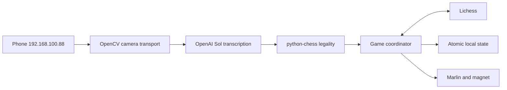

<p align="center"></p>
<h1 align="center">Chess Gantry</h1>
<p align="center"><strong>Phone camera to OpenAI Sol to legal chess to Lichess to physical Marlin motion.</strong></p>
<p align="center">
  
  
  
  
</p>

Chess Gantry observes one overhead physical board, transcribes all 64 squares
with OpenAI `gpt-5.6-sol`, accepts only stable positions that match one legal
move, and coordinates that move with local state, Lichess, and the magnetic
gantry.



> [!WARNING]
> This software moves a real gantry and energizes an electromagnet. Keep an
> independent physical cutoff within reach; verify wiring, flyback protection,
> endstops, homing, calibration, workspace clearance, chutes, and collection tray
> before execution. Software tests cannot certify mechanical safety.

## Current Capabilities

| Capability              | Status                                                          |
| ----------------------- | --------------------------------------------------------------- |
| Phone camera            | `auto:http://192.168.100.88:8080`                               |
| Fast recognition        | Local OpenCV ArUco + six calibrated cap colors                  |
| Fallback recognition    | OpenAI `gpt-5.6-sol` structured visual audit                    |
| Move validation         | Three local frames and exactly one legal successor              |
| Local two-player game   | Both people move pieces; local OpenCV registers each move       |
| Human versus Lichess/AI | Camera submits the local side; gantry executes remote side      |
| Two-AI physical mirror  | Gantry executes both sides from a fresh Lichess game            |
| Normal physical moves   | Supported with Marlin acknowledgements and local journaling     |
| Castling                | King and rook transfers supported                               |
| Human captures          | Supported because the human removes the captured piece          |
| Remote gantry captures  | Captured piece follows the safest clear route to an edge chute  |
| Promotion               | Mirror/arena use a pawn proxy; camera games require replacement |

Reed switches and MCP23017 are no longer in the runtime path. Fast move
recognition uses four ArUco board references plus calibrated color caps, with Sol
reserved for ambiguous frames and visual audit.

## Why OpenCV Is Still Installed

Sol receives images but does not open Linux cameras or network streams. OpenCV
is retained only to:

- open `/dev/video*`, MJPEG, RTSP, and other FFmpeg-backed sources;
- decode repeated JPEG snapshots;
- discard stale video buffers;
- resize and JPEG-encode the newest frame;
- serve the browser camera preview.

OpenCV does not classify pieces or infer moves.

## First Software Check

Requirements: Python 3.10+, [`uv`](https://docs.astral.sh/uv/), Node.js, npm,
and Git.

```bash
git submodule update --init --recursive
uv sync
npm ci
./scripts/demo_check.sh
```

The readiness script tests motion planning, persistence, serial protocol,
firmware policy, the Sol schema, legal move inference, game routing, echo
suppression, remote physical planning, and the web API without making paid OpenAI
calls or moving real hardware.

## Phone Camera

The configured phone is:

```text
IPv4 control page:  http://192.168.100.88:8080
IPv4 HTTPS page:    https://192.168.100.88:8080
IPv4 MJPEG:         http://192.168.100.88:8080/video
IPv4 snapshot:      http://192.168.100.88:8080/shot.jpg
IPv6 control page:  http://[2a01:b340:123:2e29:3257:6dc7:1e3b:cf57]:8080
```

Use IPv4 snapshot mode by default:

```text
snapshot:http://192.168.100.88:8080/shot.jpg
```

The HTTPS endpoint may use a self-signed phone certificate that OpenCV or FFmpeg
rejects, so plain HTTP on the trusted local LAN is the supported default. The
IPv6 URL must retain square brackets around the address.

The phone and gantry computer must be on the same non-isolated LAN. Keep the
camera app open, use the rear normal lens, disable sleep, and mount the phone
rigidly above the board. The board should fill most of the image with all four
edges visible.

## Fast Local Move Detection

Real-time games use local OpenCV, not Sol, in the critical move-detection path:

```text
phone MJPEG
-> four ArUco board references
-> 1024x1024 plan view
-> six color masks
-> per-square piece type layout
-> three stable frames
-> python-chess legal move match
```

Sol is a fallback and audit source only when local colors are incomplete or
ambiguous.

Required cap colors:

| Color  | Piece type |
| ------ | ---------- |
| Green  | Pawn       |
| Blue   | Bishop     |
| Brown  | Rook       |
| Pink   | Knight     |
| Yellow | King       |
| Orange | Queen      |

Black and White use the same type colors. Side and permanent identity are
preserved from the standard starting position plus the legal move history. The
detector never guesses side from cap color.

Use flat, matte, saturated caps of a consistent material. Avoid glossy tape,
pastel shades, translucent plastic, and colors already dominant on the board.
Each cap should occupy a clear area near the center of its square in plan view.
Brown rooks must be visibly darker than orange queens; the calibrated detector
uses brightness as well as hue to separate them.

### ArUco Board References

In **ArUco + color caps**, press **Generate 4 references** and download/print:

```text
0 top-left
1 top-right
2 bottom-right
3 bottom-left
```

Place each marker outside its corresponding board corner with all printed labels
upright in the camera image. Do not rotate individual markers. Press
**Auto-calibrate ArUco**. The marker corners nearest the playing area define the
board quadrilateral, so the phone may remain fixed overhead without being
hand-held isometrically.

### Sample Six Physical Colors

Switch to **Plan view**. For each color:

1. Select the color/type in **ArUco + color caps**.
2. Press **Sample selected color**.
3. Click the center of one real cap of that color.

All six must display `calibrated`. Profiles persist under `data/` and include
hue, saturation, and brightness, which separates dark brown rooks from bright
orange queens.

The Fast Vision panel shows detection mode, confidence, frames per second,
milliseconds per local frame, stable-frame count, and unresolved squares. Games
unlock only after three stable local observations of the standard position.

The phone app must actively start its camera server. Merely opening the app is
not enough. Its screen should show that the server is running on port 8080. If
the dashboard reports `connection refused`, restart the server inside the phone
app, keep it in the foreground, disable battery optimization, and verify the
phone still owns `192.168.100.88`.

Verify the snapshot:

```bash
curl -f http://192.168.100.88:8080/shot.jpg \
  --output /tmp/chess-board.jpg
file /tmp/chess-board.jpg
```

Or use the dashboard source probe without spending Sol tokens:

```text
Camera source: auto:http://192.168.100.88:8080
Button: Test phone
```

Auto mode opens one backend MJPEG connection and falls back to cache-busted
snapshots when needed. The GUI consumes the backend's local proxy, so the phone
never serves competing browser and Python clients. OpenCV analysis and Sol
fallback run independently of the preview.
The UI reports the resolved endpoint, image dimensions, and latency. A historical
cached image never counts as connected: the readiness strip requires a fresh
frame less than three seconds old.

MJPEG never finishes downloading, so a `curl` timeout after receiving bytes is
normal. Test it through the application instead.

## Credentials

Sol recognition requires an OpenAI API key:

```bash
export OPENAI_API_KEY='your_openai_api_key'
```

For automatic local startup, create the ignored `.env.local` file:

```bash
install -m 600 /dev/null .env.local
printf '%s\n' \
  "OPENAI_API_KEY='your_openai_api_key'" \
  "CHESS_GANTRY_CAMERA_SOURCE='snapshot:http://192.168.100.88:8080/shot.jpg'" \
  > .env.local
chmod 600 .env.local
```

Only `OPENAI_API_KEY`, `LICHESS_TOKEN`, `CLERK_PUBLISHABLE_KEY`, and
`CHESS_GANTRY_CAMERA_SOURCE` are accepted from this file. Add
`ANTHROPIC_API_KEY` to enable Claude vs ChatGPT. Group/world-readable
permissions are rejected. The secure project file overrides stale inherited
values so a previously exported API key cannot silently remain active.

Use **Connect Lichess** in the dashboard for game modes. It opens Lichess's
official OAuth Authorization Code flow with PKCE and requests only `board:play`.
The account owner must approve access; the software cannot create a token without
consent. The token remains in server memory and is never sent to JavaScript or
stored in Git. `LICHESS_TOKEN` remains an optional server-side override.

Open the dashboard at `http://127.0.0.1:8000` on the same computer when using
**Connect Lichess**; the OAuth callback is deliberately loopback-only. When the
dashboard runs on a remote Pi and the browser is on another computer, use a
server-side `LICHESS_TOKEN` override or an HTTPS reverse proxy with an approved
callback instead of weakening the callback check.

## Test Sol Before Starting A Game

Start with the higher-quality snapshot endpoint:

```bash
export OPENAI_API_KEY='your_openai_api_key'

uv run chess-gantry vision-test \
  --source 'snapshot:http://192.168.100.88:8080/shot.jpg' \
  --orientation white_bottom \
  --frames 1 \
  --preview-output data/last-camera-frame.jpg
```

Expected output includes:

```json
{
  "status": "complete",
  "rows": {
    "row_1": "rnbqkbnr",
    "row_2": "pppppppp",
    "row_3": "........",
    "row_4": "........",
    "row_5": "........",
    "row_6": "........",
    "row_7": "PPPPPPPP",
    "row_8": "RNBQKBNR"
  }
}
```

If Black is nearest the bottom of the phone image, use:

```bash
--orientation black_bottom
```

`partial`, `unusable`, and `not_found` results are never converted into moves.
Sol is instructed to return `x` for known occupancy with uncertain identity and
`?` for uncertain occupancy rather than guessing.

## Run The Full Web Software

Local development or direct Pi run:

```bash
export OPENAI_API_KEY='your_openai_api_key'

uv run chess-gantry --config config.json web
```

Open:

```text
http://127.0.0.1:8000
```

The camera source is prefilled with:

```text
snapshot:http://192.168.100.88:8080/shot.jpg
```

In the UI:

1. Start recognition and rotate the frame upright.
2. Select which side is nearest the bottom.
3. Press **Calibrate 4 corners** and click top-left, top-right, bottom-right, then
   bottom-left. The software perspective-warps that shape to a square 1024×1024
   board before Sol sees it.
4. Sample all six cap colors and wait for `complete`, `3 / 3`, and an exact
   standard-position match.
5. Confirm every displayed square, grid coordinate, and machine millimeter value.
6. Scan serial ports, select the CH340 device/baud, connect, and home.
7. Use **Connect Lichess** for Lichess modes.
8. Resolve any pending transaction before starting the full game.

## Guided Hardware Setup

The dashboard contains a **Hardware test matrix**. Run it in order after the
phone board crop is calibrated.

### Four Board Reference Points

Start the phone camera, rotate it upright, then press **Calibrate 4 corners**.
Click the visible playing-area corners in this exact order:

```text
1. top-left
2. top-right
3. bottom-right
4. bottom-left
```

Use **Raw frame** while clicking references. After calibration, use **Plan view**
to inspect the authoritative 1024×1024 top-down board sent to Sol. The plan view
must show a square board with straight file/rank boundaries and no surrounding
table. If it does not, clear the crop and click the four playing-area corners
again.

Clicks are normalized to the actual visible image, excluding black letterbox
bars. The four points must form a convex quadrilateral covering a meaningful
part of the frame. OpenCV transforms it into a square 1024×1024 board before
Sol receives it. Calibration is persisted under `data/` and cleared when the
camera source or rotation changes.

Camera capture and Sol inference run on separate threads. A slow Sol request no
longer freezes the browser preview or camera reconnect loop. Status distinguishes
phone capture failures from Sol API failures.

### Test Matrix

1. **Diagnostics** sends only `M115`, `M119`, and `M114`. It requires Relay
   Chess Gantry firmware, all three required endstop fields, and a parseable
   position.
2. **Endstops** takes another `M119` snapshot and verifies `x_min`, `y_max`, and
   `z_max` are present.
3. **Home** runs configured `G28 X Y Z`, waits, applies the measured reference,
   and requires `M114` to match `X2 Y298 Z328` within 0.25 mm.
4. **Move 5 mm** moves each logical gantry direction inward and back at 300
   mm/min. It uses no `G92`, keeps `M211 S1`, keeps the magnet off, and verifies
   return position.
5. **Pulse magnet** energizes fan P0 for exactly one second and always attempts
   magnet-off cleanup.
6. **Visit centers** traverses all 64 measured square centers at 1800 mm/min
   with the magnet off, then returns to the verified home coordinate and checks
   `M114`.

Before any physical step, type:

```text
SETUP AREA CLEAR
```

**Run complete setup** performs the same six steps in sequence and stops on the
first failure. A pending transaction blocks every actuator test. Rehoming
invalidates movement, magnet, and center-test completion so they must be rerun.

Use the independent physical cutoff if anything moves incorrectly. The GUI
emergency stop remains available throughout setup.

## Game Modes

### Terminal Lichess Mirror, No Vision

For a fresh public Lichess game with zero moves:

```bash
./scripts/mirror_lichess.sh GAME_ID
```

The script asks for the exact confirmation `MIRROR BOARD AND CHUTES READY`, which
confirms the standard board, installed collection tray, clear X0 chutes, and
clear X10 castling buffers. It then:

- initializes isolated state under `data/lichess-mirror/GAME_ID/physical/`;
- rejects games that already contain moves;
- opens one persistent Marlin connection;
- homes once;
- permits each Marlin acknowledgement wait, including a blocking `M400`, up to
  five minutes instead of the previous two-minute per-command ceiling;
- renders an ASCII terminal board and status;
- validates every streamed UCI move with `python-chess`;
- verifies the remote move list still starts with the exact committed prefix;
- executes one physical ply at a time;
- persists FEN, UCI history, physical revision, and compound-ply progress;
- reconnects with bounded exponential backoff;
- prevents replay after restart;
- forces the magnet off and restores software endstops on exit.

The default fast profile is:

```text
travel: 12000 mm/min
drag:    3000 mm/min
parking: disabled between moves
```

Use calibrated configured feeds instead:

```bash
./scripts/mirror_lichess.sh GAME_ID --configured-speed
```

Simulate the complete terminal mirror without hardware:

```bash
./scripts/mirror_lichess.sh GAME_ID --demo --once --no-screen
```

Inspect physical mirror state:

```bash
./scripts/mirror_lichess.sh status GAME_ID
```

Inspect or reconcile an uncertain physical move:

```bash
./scripts/mirror_lichess.sh reconcile GAME_ID

./scripts/mirror_lichess.sh reconcile GAME_ID \
  --mark-applied --confirm-physical-state

./scripts/mirror_lichess.sh reconcile GAME_ID \
  --discard --confirm-physical-state
```

By default the command uses Lichess's public game stream. Public spectator
streams may be delayed by Lichess anti-cheating policy. For an account-owned
Board API game with an authorized `LICHESS_TOKEN`, use:

```bash
./scripts/mirror_lichess.sh GAME_ID --stream-mode board
```

If the terminal receives the move late, local path optimization cannot remove
that upstream spectator delay. Board mode is the supported low-latency path for
a game played by the authenticated account.

Capture path planning previously took about two seconds on the development
machine. Capture ejection now uses a dedicated 15 mm search grid with continuous
30 mm segment-clearance verification; the same benchmark is about 0.26 seconds
median. The planner still maximizes minimum clearance first and minimizes route
length second. A completely enclosed captured piece fails before the magnet is
energized rather than taking an unsafe route.

Captures are carried to the safest reachable edge chute and released beyond the
playing area. En passant removes the pawn from its actual capture square. Castling uses
three persisted physical stages: rook to buffer, king to destination, rook from
buffer to destination. Promotion keeps the pawn as the physical proxy while the
virtual board tracks its promoted type. The cursor advances only after every
physical stage completes.

### Offline Game Replay

Replay a saved standard-start PGN through simulated Marlin:

```bash
./scripts/replay_game.sh examples/replays/capture-checkmate.pgn \
  --demo --no-screen
```

Replay it on the physical gantry:

```bash
./scripts/replay_game.sh examples/replays/capture-checkmate.pgn
```

The physical script requires the exact confirmation:

```text
REPLAY BOARD AND CHUTES READY
```

Replay uses the same move validation, persistent physical piece IDs, magnetic
capture routing, en passant handling, castling buffer, promotion proxy, Marlin
connection, homing, journal, and recovery logic as live mirroring. It accepts
exactly one PGN, requires standard chess from the initial position, and rejects
an invalid or non-standard game before opening the serial port.

Included replay samples:

| File                                       | Coverage                                                             |
| ------------------------------------------ | -------------------------------------------------------------------- |
| `examples/replays/capture-checkmate.pgn`   | Normal capture ending in checkmate                                   |
| `examples/replays/en-passant-castling.pgn` | En passant, recapture, and kingside castling                         |
| `examples/replays/capture-promotion.pgn`   | Multiple captures and capture-promotion pawn proxy                   |
| `examples/replays/opera-game.pgn`          | Full 33-ply game, captures, queenside castling, sacrifices, and mate |

Pause between plies:

```bash
./scripts/replay_game.sh examples/replays/en-passant-castling.pgn \
  --demo --move-delay 1.5
```

Stop after a fixed number of additional plies, then resume with the same command:

```bash
uv run chess-gantry --config config.json replay-game \
  examples/replays/en-passant-castling.pgn --demo --max-plies 5

uv run chess-gantry --config config.json replay-game \
  examples/replays/en-passant-castling.pgn --demo
```

Replay state is isolated by the PGN's canonical UCI hash under
`data/chess-replay/REPLAY_ID/{physical,demo,simulation}/`. Re-running a completed
session sends no duplicate moves and does not home. To physically replay it from the beginning,
return every piece to the standard position and pass `--reset-session`.

Inspect or reconcile an interrupted physical replay using the same PGN:

```bash
./scripts/replay_game.sh examples/replays/en-passant-castling.pgn --status

./scripts/replay_game.sh examples/replays/en-passant-castling.pgn \
  --mark-applied

./scripts/replay_game.sh examples/replays/en-passant-castling.pgn \
  --discard-pending
```

Reconciliation requires the exact confirmation
`REPLAY PHYSICAL STATE VERIFIED`. Reset refuses to remove a pending transaction.

Software validation cannot certify mechanical perfection. Before relying on a
live game, run all three samples in `--demo`, then physically replay them at
configured speed while observing chute clearance, magnet pickup/release, and
castling buffer placement. The repository verifies legal/state/transaction/path
behavior, but only a real gantry run can validate alignment, friction, magnet
strength, tray geometry, and current firmware timing.

### Physical Claude Vs ChatGPT

Add both provider keys to the ignored `.env.local` file:

```text
OPENAI_API_KEY='your_openai_key'
ANTHROPIC_API_KEY='your_anthropic_key'
CHESS_GANTRY_CAMERA_SOURCE='auto:http://192.168.100.88:8080'
```

Then:

```bash
chmod 600 .env.local
```

Restart the dashboard and open **Claude vs ChatGPT**:

1. Confirm ChatGPT and Claude both show `Ready`.
2. Choose which provider controls White.
3. Choose style, move delay, and maximum plies.
4. Keep **Execute normal moves physically** selected.
5. Press **Start Claude vs ChatGPT**.

The arena homes once, keeps one persistent Marlin connection, asks each provider
for a move from a server-generated legal UCI allowlist, validates it, and
executes normal moves physically. The board, SAN score, provider, rationale,
plan, latency, FEN, check state, and result update live.

Captures use the calibrated edge chute, en passant ejects the pawn from its
actual square, and castling uses the temporary edge buffer. On promotion, the
pawn remains the physical proxy while the virtual board tracks its promoted
type, allowing the game to continue without an off-board reserve set.

Claude requires `ANTHROPIC_API_KEY`; the OpenAI key cannot authenticate to
Anthropic. Without it, the GUI displays the missing provider and disables Start.

### Two People On One Board

Select:

```text
Two people, one physical board
```

Both people move their own pieces. Sol registers every legal changed position.
The gantry does not repeat those moves because they already happened physically.
Human captures are supported when the player removes the captured piece.

### Human Versus Lichess Or An AI

1. Use **Connect Lichess** and approve `board:play`.
2. Create a fresh Lichess Board API game with zero moves.
3. Enter the game ID and press **Validate game**. The server verifies scope,
   account participation, game access, zero moves, and unfinished status.
4. Put the physical board in the standard position.
5. Select **Camera player vs Lichess / AI**.
6. Start before the first move.

Camera moves are written with `client.board.make_move(game_id, uci)`. Opponent
moves arrive through the authenticated Board API stream. The local Lichess echo
is suppressed so the gantry never repeats a move already made physically.

Flow:

```text
Human moves physically
-> Sol observes the move twice
-> python-chess validates it
-> local physical state updates without gantry motion
-> move is submitted once to Lichess
-> Lichess echo is acknowledged without duplicate motion
-> opponent/AI move arrives
-> gantry homes/executes with Marlin acknowledgements
-> camera rule state advances to the expected position
```

### Two AI Or Remote Players On The Physical Board

Select:

```text
Mirror Lichess / two AI physically
```

Start with a fresh zero-move Lichess game. The gantry homes once and executes
every move from the authenticated Board API stream for both sides. Camera
inference is paused during gantry motion.

## Physical Motion

The physical E-driver motor is exposed by firmware as logical Z:

```text
Physical X driver -> Marlin X -> x_min
Physical Y driver -> Marlin Y -> y_max
Physical E driver -> Marlin Z -> z_max
Physical Z driver -> unused
Electromagnet     -> Marlin fan P0
```

Configured homing:

```gcode
G28 X Y Z
M400
G92 X2 Y298 Z328
M400
```

Before a real game:

```bash
uv run chess-gantry --config config.json diagnose

uv run chess-gantry --config config.json home-gantry \
  --confirm-motion --confirm-clear-path

uv run chess-gantry --config config.json motor-test \
  --distance-mm 5 --feed-mm-min 300 --confirm-motion
```

The game coordinator opens one persistent serial connection and homes on that
same connection before executing remote moves. Every Marlin command must return
`ok`; `M400` waits for queued motion to finish.

If a CH340 `/dev/ttyUSB*` node disappears after opening, restore controller power
and the USB data cable, then press **Scan ports**. The serial connector suppresses
DTR/RTS reset, ignores motherboard serial ports when a likely USB controller is
available, and waits for USB re-enumeration between 115200 and 250000 attempts.
If no tty node returns, the remaining fault is below the application layer.

## Pending Transaction Recovery

This checkout currently may contain `data/pending_move.json`. The software will
not start a game or physical move while that file exists.

Inspect it:

```bash
uv run chess-gantry --config config.json reconcile
```

If the physical move completed exactly as recorded:

```bash
uv run chess-gantry --config config.json reconcile \
  --mark-applied --confirm-physical-state
```

If no part completed and the board still matches committed state:

```bash
uv run chess-gantry --config config.json reconcile \
  --discard --confirm-physical-state
```

Never guess. Restore a known physical position if uncertain.

## Raspberry Pi And Docker

Install on a 64-bit Pi:

```bash
sudo apt update
sudo apt install -y git curl
git clone --recurse-submodules https://github.com/odinglyn0/Chess.git
cd Chess
./scripts/install_pi.sh
```

Run the distroless image:

```bash
export OPENAI_API_KEY='your_openai_api_key'
./run.sh
```

`run.sh` passes:

- `/dev/ttyUSB0` when available;
- `/dev/video0` when `CHESS_GANTRY_VIDEO_DEVICE` is set;
- the phone URL through `CHESS_GANTRY_CAMERA_SOURCE`;
- the OpenAI credential only when exported;
- an optional Lichess token override, otherwise dashboard OAuth;
- `config.json` read-only and `data/` read-write.

Override the phone source:

```bash
CHESS_GANTRY_CAMERA_SOURCE='snapshot:http://192.168.100.88:8080/shot.jpg' \
  ./run.sh
```

The final image is `FROM scratch`, runs as UID/GID 65532, and has no shell or
package manager. It contains OpenCV because camera stream decoding happens
locally before images are sent to Sol.

## Mechanical Limits

| Property                   | Value          |
| -------------------------- | -------------- |
| Inner gantry width         | 330 mm         |
| Outer paired gantry height | 300 mm         |
| Square spacing             | 40 mm          |
| Nearest-home square        | h1             |
| Homed host reference       | `X2 Y298 Z328` |

Physical capture ejection is configured in `config.json`:

```text
edge chutes: X0 Y0 and X0 Y300
castle buffers: X10 Y0 and X10 Y300
```

Install a collection tray or open drop area beyond the X0 edge before running a
game. The gantry carries the captured piece to the safest reachable chute and releases
the magnet; it does not launch pieces with uncontrolled acceleration. Keep the
chute and buffer strip clear. If your physical board support does not leave the
piece center beyond the edge at X0, recalibrate these coordinates before use.

Capture transport uses a separate A* profile with a 30 mm magnetic keepout from
every remaining piece. It evaluates every configured chute, favors the route
with the greatest minimum clearance, and stops before energizing the magnet if
no route can maintain that clearance. This prevents the energized carriage and
captured piece from taking a merely short route past neighboring pieces.

## Emergency Stop

Use the independent physical cutoff first when immediate isolation is required.

```bash
uv run chess-gantry --config config.json stop
```

This sends Marlin `M112`. Reset or power-cycle the controller, reconnect,
diagnose, and home before continuing.

## Recover A Failed Home

If the dashboard reports `Homing Failed`, `Printer halted`, or the CH340 tty
device disappears:

1. Use the physical cutoff and stop all motion.
2. Inspect all three endstop switches and wiring. Before homing, `M119` may show
   them open; each must reliably change to triggered when pressed by hand.
3. Verify no axis is mechanically jammed or already pressing past a switch.
4. Power-cycle the Marlin controller. Software cannot clear Marlin `kill()` by
   reopening a missing tty node.
5. Reseat the USB data cable and wait for:

```bash
ls -l /dev/ttyUSB* /dev/serial/by-id/*
```

6. In the dashboard press **Scan ports**, connect the stable by-id device at
   115200, then run only **Diagnostics** and **Endstops**.
7. Press each endstop by hand and confirm its `M119` state changes before
   attempting Home again.
8. Clear the entire homing path, keep the cutoff ready, type
   `SETUP AREA CLEAR`, and run Home once.

Do not run movement, magnet, center, or game tests after a failed home. They stay
locked until strict post-home `M114` verification passes.

## Development

```bash
uv sync
npm ci
./scripts/check.sh
npm run check
```

Show command help:

```bash
uv run chess-gantry --help
uv run chess-gantry vision-test --help
uv run chess-gantry web --help
```

The automated suite uses fake Sol and Lichess clients, so CI does not spend API
credits or manipulate a live game. A real full-game test additionally requires
`OPENAI_API_KEY`, `LICHESS_TOKEN`, the reachable phone, the Pi, Marlin, and the
physical board.

---

<p align="center">Built at <strong>Patch</strong> by Basil Amin, Ben Hewston, Kelvin Gao, and Odin Glynn.</p>
